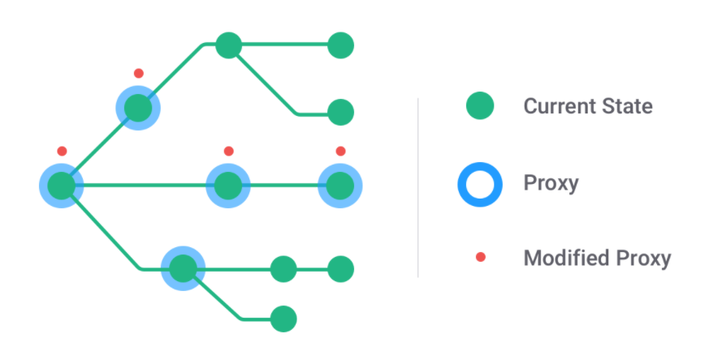
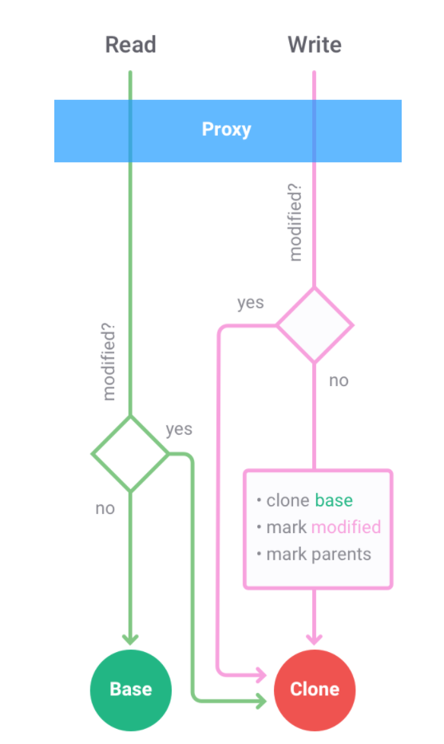

## immer
> Immer (German for: always) is a tiny package that allows you to work with immutable state in a more convenient way. It is based on the copy-on-write mechanism.  

就想官网说的immer就是一个非常小的用来实现对不可变数据操作的包，基于**写时复制**机制实现。  

之前的immutable.js也可以用来操作不可变数据，但是基本要用它内部封装的数据结构方法，主要起来复杂度较高。immer的主要方法就**produce**，使用起来就很清爽。

## 使用immer改造Redux
原本的Reducer  

```
const reducer = function (state, action) {
    if (typeof state === 'undefined') state = initialState;
    switch (action.type) {
    case ACTIVATE_TAB:
        return Object.assign({}, state, {
            activeTabIndex: action.activeTabIndex
        });
    case WHETHER_DELETE:
        return Object.assign({}, state, {
            whetherDeleteCanvas: action.whetherDeleteCanvas
        });
    default:
        return state;
    }
};
```

使用immer  

```
const reducer = produce((draft, action) => {
        switch (action.type) {
            case ACTIVATE_TAB:
                draft.activeTabIndex = action.activeTabIndex;
                break;
            case WHETHER_DELETE:
                draft.whetherDeleteCanvas = action.whetherDeleteCanvas;
                break;
}, initialState);
```

## 改造setState
没使用immer
```
this.state = {
        user: {
            age: 22
            name: ''
        }
    }
}

onInputChange = (event: React.ChangeEvent<HTMLInputElement>)  => {
    const now = event.target.value;
    this.setState(
       prevState => ({
            user: {
                ...prevState.user,
                name: ''
            }
       })
    )
}
```
使用immer
```
onInputChange = (event: React.ChangeEvent<HTMLInputElement>)  => {
    const now = event.target.value;
    this.setState(
        produce(draft => {
            draft.user.name = now
        })
    )
}
```
对于在setState中的使用，主要是如果存在嵌套数据的话，使用起来心情舒畅了，眼睛也不干了。

## immutable -> 不可变数据
- immutable: 去除引用数据类型副作用的数据的概念。每当我们创建一个被 deepClone 过的数据，新的数据进行有副作用 (side effect) 的操作都不会影响到之前的数据。 

## Proxy  
immer的内部是通过proxy来监听处理数据的  

    

Proxy 只能监听到当前层的属性访问，所以代理关系也要按需创建  

根节点预先创建一个 Proxy，对象树上被访问到的所有中间节点（或新增子树的根节点）都要创建对应的 Proxy。  

而每个 Proxy 都只在监听到写操作（直接赋值、原生数据操作 API 等）时才创建拷贝值（所谓Copy-on-write），并将之后的写操作全都代理到拷贝值上。  

最后，将这些拷贝值与原值整合起来，得到数据操作结果。  

> Immer = Copy-on-write + Proxy  

  

> Now, as soon as you try to change something on a proxy (directly or through any API), it will immediately create a shallow copy(浅层复制) of the node in the source tree it is related to, and sets a flag “modified”. From now on, any future read and write to that proxy will not end up in the source tree, but in the copy. Also, any parent that was unmodified so far will be marked “modified”.

### copy-on-write(写时复制) 
> 只在数据发生改变（write）时才拷贝数据结构（copy），否则共享同一个  

```
copy === myStructure  // true
modified !== myStructure  // true
```

### Proxy
> 监听数据变化，进行操作拦截、重定向  

```
const data = { a: 1 };
const proxy = new Proxy(data, {
  set(target, key, value, receiver) {
    console.log(`Set key = ${key}, value = ${value}`);
    return Reflect.set(target, key, value, receiver);
  }
});

proxy.a = 2;
// 输出 Set key = a, value = 2
data.a === 2  // true
```

```
const data = { a: 1 };
const copy = {};
const p = new Proxy(data, {
  set(target, key, value, receiver) {
    // 不写回data
    // return Reflect.set(target, key, value, receiver);
    // 全都写到copy上
    Reflect.set(copy, key, value, receiver);
  }
});

p.a = 2;
data.a === 1  // true
copy.a === 2  // true
```

### copy-on-write + Proxy
```
function produce(data, producer) {
  let copy;
  const copyOnWrite = value => {
    copy = Object.assign({}, value);
  };

  const proxy = new Proxy(data, {
    set(target, key, value, receiver) {
      // 写时复制
      !copy && copyOnWrite(data);
      // 全都写到copy上
      Reflect.set(copy, key, value, copy);
    }
  });
  producer(proxy);
  return copy || data;
}
```
